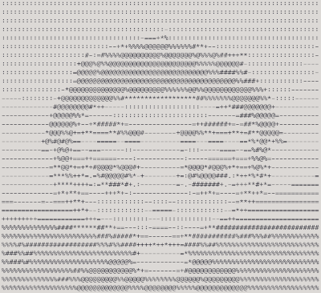
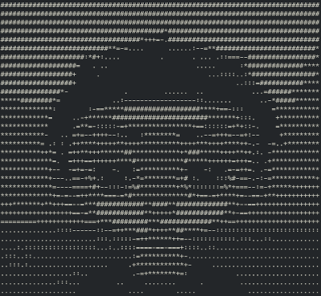

# Image-to-ASCII-converter

A simple Python image to ASCII converter.
It accepts an input image and outputs a text file.
No colors, for now. Maybe in the future...

## Preview

### Original

### Black on white

### White on black

## Usage

It's quite simple for now, you can use it just setting the input file and letting it do the rest. Optionally it has some arguments.

## Basic command:
> python3 main.py --file filename.ext

Replace "filename.ext" with the name of your *input file* **WITH** it's extension

## Optional arguments:

### --scale x

Replace "x" with a *float* value (e.g. *0.547* if you will use the *Hack* font)

This parameter adjusts the height based on your font aspect-ratio

You can use [this](https://www.brunildo.org/test/xheight.pl) tool to calculate it's value

If left blank it will default to *0.43* to match the *Courier* font

### --out filename.txt

Replace "filename.txt" with the name of your *output file* **WITH** it's extension

This flag sets the name of your output file

If left blank your output file will be named "out.txt" and will be placed in the current folder

### --cols x

Replace "x" with an *integer* value

This flag sets the number of columns of your output file, determining it's horizontal resolution

If left blank it will default to 80

### --morelevels

This is a flag, and if not used will default to False

If used it will set the default 10 levels of gray ASCII palette to a 70 levels of gray palette

### --reversedgradient

This is a flag, and if not used will default to False

Use it if your background is dark

If used it will reverse-sort the two ASCII palettes, reversing the gradients

## Credits

The starting point was this [article from GeeksforGeeks](https://www.geeksforgeeks.org/converting-image-ascii-image-python/).

The base code was in [this](https://github.com/electronut/pp/tree/master/ascii) repository from [Electronut Labs](https://github.com/electronut).

A walkthtrough to the original code can be found in the book [Python Playground](http://www.nostarch.com/pythonplayground) published by No Starch Press, USA.

The source code is published here as per the MIT License below:

# The MIT License (MIT)
## Copyright (c) 2022 Cristiano Di Salvo

*Permission is hereby granted, free of charge, to any person obtaining a copy of this software and associated documentation files (the "Software"), to deal in the Software without restriction, including without limitation the rights to use, copy, modify, merge, publish, distribute, sublicense, and/or sell copies of the Software, and to permit persons to whom the Software is furnished to do so, subject to the following conditions:*

*The above copyright notice and this permission notice shall be included in all copies or substantial portions of the Software.*

*THE SOFTWARE IS PROVIDED "AS IS", WITHOUT WARRANTY OF ANY KIND, EXPRESS OR IMPLIED, INCLUDING BUT NOT LIMITED TO THE WARRANTIES OF MERCHANTABILITY, FITNESS FOR A PARTICULAR PURPOSE AND NONINFRINGEMENT. IN NO EVENT SHALL THE AUTHORS OR COPYRIGHT HOLDERS BE LIABLE FOR ANY CLAIM, DAMAGES OR OTHER LIABILITY, WHETHER IN AN ACTION OF CONTRACT, TORT OR OTHERWISE, ARISING FROM, OUT OF OR IN CONNECTION WITH THE SOFTWARE OR THE USE OR OTHER DEALINGS IN THE SOFTWARE.*
